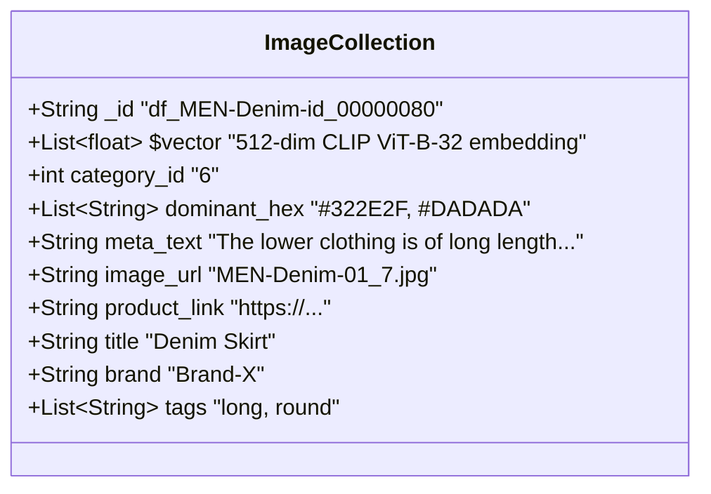
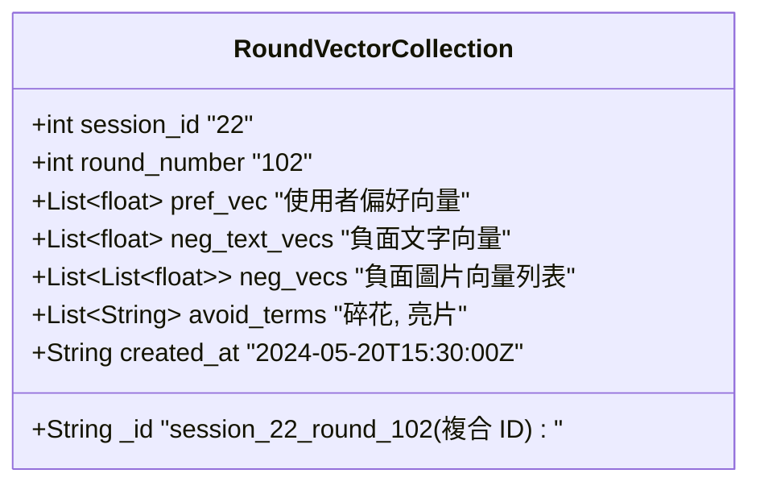
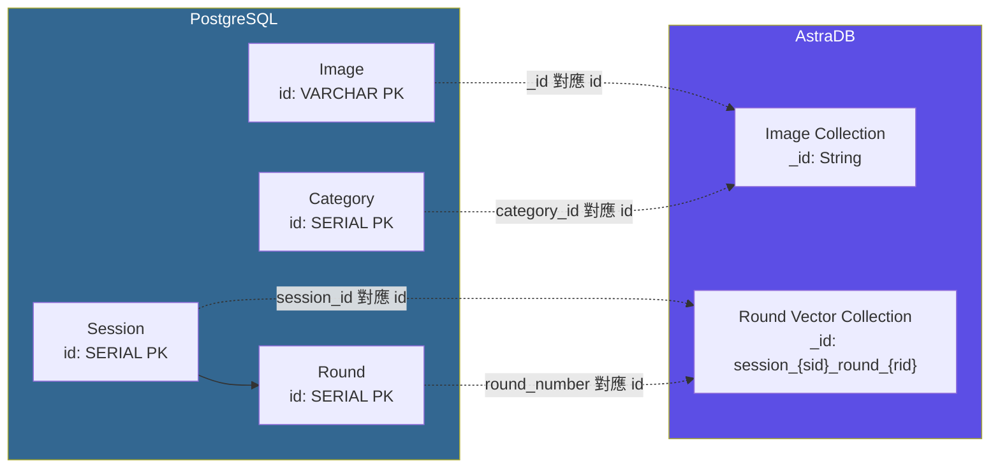

# AuraWear — Database Schema

## Overview

AuraWear 使用兩種資料庫：

| 資料庫         | 用途           | 儲存內容                                         |
| -------------- | -------------- | ------------------------------------------------ |
| **PostgreSQL** | 關聯式業務資料 | 使用者、Session、Round、推薦結果、購物車、查找表 |
| **AstraDB**    | 向量資料庫     | 圖片 embedding 向量、Round 偏好向量              |

---

## Part 1 — PostgreSQL（關聯式資料庫）

### ER Diagram

```mermaid
erDiagram
    User {
        string id PK "e.g. user_001"
        string user_name
        timestamp created_at
    }

    Sex {
        int id PK
        string name "Male / Female / Unisex / Untold"
    }

    Style {
        int id PK
        string name "e.g. Streetwear"
    }

    Season {
        int id PK
        string name "e.g. Light Spring"
    }

    Color {
        int id PK
        int season_id FK
        string color_code "e.g. ls_01"
        string name "e.g. Peach Blossom"
        string color_hex "e.g. #FFB7A5"
    }

    Category {
        int id PK
        string name "top / pants / dress / ..."
    }

    Image {
        string id PK "e.g. df_MEN-Denim-id_00000080-01_7_additional"
        string image_url
        int category_id FK
        text dominant_hex "JSON List of hex strings"
        string product_link "nullable"
        string title
        string style
        string brand
        text tags "JSON List of strings"
        text meta_text
    }

    ImageAction {
        int id PK
        string name "LIKE / DISLIKE / ADD_TO_CART"
    }

    Session {
        int id PK
        string user_id FK
        string user_image
        int gender_id FK
        int style_id FK
        int detected_season_id FK
        string skin_color_hex
        string hair_color_hex
        string eye_color
        timestamp created_at
    }

    Round {
        int id PK
        int session_id FK
        text selected_palette_ids "JSON Array of color_code"
        text user_comment "nullable"
        timestamp created_at
    }

    RoundRecommendedResult {
        int id PK
        int round_id FK
        string image_id FK
        int rank_order
        int action_type_id FK "nullable"
        text dislike_desc "nullable"
        text explanation_text
        boolean isInCart
        timestamp created_at
    }

    Cart {
        int id PK
        string user_id FK
        string image_id FK
        string link
        timestamp update_at
    }

    User ||--o{ Session : "creates"
    Session }o--|| Sex : "gender_id"
    Session }o--|| Style : "style_id"
    Session }o--|| Season : "detected_season_id"
    Session ||--o{ Round : "contains"
    User ||--o{ Cart : "has"
    Round ||--o{ RoundRecommendedResult : "generates"
    RoundRecommendedResult }o--|| Image : "references"
    RoundRecommendedResult }o--o| ImageAction : "action_type_id"
    Cart }o--|| Image : "references"
    Image }o--|| Category : "category_id"
    Color }o--|| Season : "belongs_to"
```

---

### Table Details

#### `User` — 使用者

| 欄位         | 類型         | 說明             | 範例                  |
| ------------ | ------------ | ---------------- | --------------------- |
| `id`         | `VARCHAR` PK | 使用者唯一識別碼 | `user_001`            |
| `user_name`  | `VARCHAR`    | 使用者名稱       | `Christine`           |
| `created_at` | `TIMESTAMP`  | 建立時間         | `2024-05-20 15:30:00` |

#### `Session` — 對話視窗

使用者上傳照片、選擇季節色 / 性別 / 風格後產生。一個 Session 代表一次完整的推薦對話。

| 欄位                 | 類型                | 說明                 | 範例                         |
| -------------------- | ------------------- | -------------------- | ---------------------------- |
| `id`                 | `SERIAL` PK         | Session ID           | `1`                          |
| `user_id`            | `VARCHAR` FK → User | 所屬使用者           | `user_001`                   |
| `user_image`         | `VARCHAR`           | 使用者上傳的照片路徑 | `uploads/user_001_photo.jpg` |
| `gender_id`          | `INT` FK → Sex      | 選擇的性別           | `1` (Male)                   |
| `style_id`           | `INT` FK → Style    | 選擇的風格           | `5` (Streetwear)             |
| `detected_season_id` | `INT` FK → Season   | AI 偵測的季節色      | `1` (Light Spring)           |
| `skin_color_hex`     | `VARCHAR(7)`        | 膚色色碼             | `#D4A574`                    |
| `hair_color_hex`     | `VARCHAR(7)`        | 髮色色碼             | `#4A3728`                    |
| `eye_color`          | `VARCHAR`           | 眼睛顏色             | `brown`                      |
| `created_at`         | `TIMESTAMP`         | 建立時間             | `2024-05-20 15:30:00`        |

#### `Round` — 推薦輪次

一個 Session 可有多個 Round。每次 Regenerate 產生新 Round，記錄該輪使用者的選擇與留言。

| 欄位                   | 類型               | 說明                    | 範例                  |
| ---------------------- | ------------------ | ----------------------- | --------------------- |
| `id`                   | `SERIAL` PK        | Round ID                | `1`                   |
| `session_id`           | `INT` FK → Session | 所屬 Session            | `22`                  |
| `selected_palette_ids` | `JSONB`            | 該輪選擇的調色盤顏色 ID | `["ls_01", "ls_03"]`  |
| `user_comment`         | `TEXT`             | 使用者留言（nullable）  | `我想要更時尚的風格`  |
| `created_at`           | `TIMESTAMP`        | 建立時間                | `2024-05-20 15:30:00` |

#### `RoundRecommendedResult` — 推薦結果

記錄每個 Round 被推薦的圖片與使用者對其的操作。

| 欄位               | 類型                   | 說明                       | 範例                  |
| ------------------ | ---------------------- | -------------------------- | --------------------- |
| `id`               | `SERIAL` PK            | 記錄 ID                    | `1`                   |
| `round_id`         | `INT` FK → Round       | 所屬 Round                 | `1`                   |
| `image_id`         | `VARCHAR` FK → Image   | 推薦圖片 ID                | `df_00089`            |
| `rank_order`       | `INT`                  | 推薦排序（分數高→低）      | `1`                   |
| `action_type_id`   | `INT` FK → ImageAction | 使用者操作（nullable）     | `1` (LIKE)            |
| `dislike_desc`     | `TEXT`                 | 不喜歡原因描述（nullable） | `風格不符`            |
| `explanation_text` | `TEXT`                 | AI 推薦說明                | `完美的調色板匹配...` |
| `isInCart`         | `BOOLEAN`              | 是否已加入購物車           | `true`                |
| `created_at`       | `TIMESTAMP`            | 建立時間                   | `2024-05-20 15:30:00` |

#### `Cart` — 購物車

購物車以使用者（User）為單位，跨所有 Session 收集使用者加入的圖片。

| 欄位        | 類型                 | 說明                         | 範例                  |
| ----------- | -------------------- | ---------------------------- | --------------------- |
| `id`        | `SERIAL` PK          | 購物車項目 ID                | `1`                   |
| `user_id`   | `VARCHAR` FK → User  | 所屬使用者（跨所有 Session） | `user_001`            |
| `image_id`  | `VARCHAR` FK → Image | 圖片 ID                      | `df_00089`            |
| `link`      | `VARCHAR`            | 商品外部連結                 | `https://...`         |
| `update_at` | `TIMESTAMP`          | 加入購物車時間               | `2024-05-20 15:30:00` |

#### `Image` — 圖片資料

前處理程式將服飾圖片轉換後的結構化資料。注意：`emb` (向量) 存放於 AstraDB。

| 欄位           | 類型                | 說明                 | 範例                                        |
| -------------- | ------------------- | -------------------- | ------------------------------------------- |
| `id`           | `VARCHAR` PK        | 商品唯一識別碼       | `df_MEN-Denim-id_00000080-01_7_additional`  |
| `image_url`    | `VARCHAR`           | 圖片相對路徑         | `MEN-Denim-id_00000080-01_7_additional.jpg` |
| `category_id`  | `INT` FK → Category | 衣物分類             | `1` (top)                                   |
| `dominant_hex` | `JSONB`             | 主色十六進制碼列表   | `["#322E2F", "#DADADA"]`                    |
| `product_link` | `VARCHAR`           | 商品連結（nullable） | `null`                                      |
| `title`        | `VARCHAR`           | 商品描述標題         | `The lower clothing is of long length...`   |
| `style`        | `VARCHAR`           | 風格標籤             | `round cotton`                              |
| `brand`        | `VARCHAR`           | 品牌                 | `""`                                        |
| `tags`         | `JSONB`             | 結構化屬性標籤       | `["long", "round", "not-cardigan"]`         |
| `meta_text`    | `TEXT`              | 元描述文字           | `The lower clothing is of long length...`   |

---

### Lookup Tables（查找表）

#### `Sex` — 性別選項

| id  | name   |
| --- | ------ |
| 1   | Male   |
| 2   | Female |
| 3   | Unisex |
| 4   | Untold |

#### `Style` — 風格選項

| id  | name                                     |
| --- | ---------------------------------------- |
| 1   | Classic Tailoring                        |
| 2   | Smart Casual / Workwear                  |
| 3   | Minimalist / Clean                       |
| 4   | Denim & Basics (Everyday Casual)         |
| 5   | Streetwear                               |
| 6   | Edgy / Rock                              |
| 7   | Avant-Garde / Fashion-Forward            |
| 8   | Athleisure                               |
| 9   | Techwear / Gorpcore (Outdoor Functional) |
| 10  | Bohemian                                 |

#### `Category` — 衣物分類

| id  | name     |
| --- | -------- |
| 1   | top      |
| 2   | pants    |
| 3   | dress    |
| 4   | outer    |
| 5   | rompers  |
| 6   | skirt    |
| 7   | leggings |

#### `Season` — 季節色分類

| id  | name          |
| --- | ------------- |
| 1   | Light Spring  |
| 2   | True Spring   |
| 3   | Bright Spring |
| 4   | Light Summer  |
| 5   | True Summer   |
| 6   | Soft Summer   |
| 7   | Soft Autumn   |
| 8   | True Autumn   |
| 9   | Deep Autumn   |
| 10  | Bright Winter |
| 11  | True Winter   |
| 12  | Deep Winter   |

#### `Color` — 季節色顏色

| 欄位         | 類型              | 說明         | 範例               |
| ------------ | ----------------- | ------------ | ------------------ |
| `id`         | `SERIAL` PK       | 顏色 ID      | `1`                |
| `season_id`  | `INT` FK → Season | 所屬季節     | `1` (Light Spring) |
| `color_code` | `VARCHAR`         | 顏色代碼     | `ls_01`            |
| `name`       | `VARCHAR`         | 顏色名稱     | `Peach Blossom`    |
| `color_hex`  | `VARCHAR(7)`      | 十六進制色碼 | `#FFB7A5`          |

#### `ImageAction` — 圖片操作類型

| id  | name        |
| --- | ----------- |
| 1   | LIKE        |
| 2   | DISLIKE     |
| 3   | ADD_TO_CART |

---

## Part 2 — AstraDB（向量資料庫）

AstraDB 負責儲存高維向量資料，用於 AI 推薦演算法的相似度計算。

### Collection 1: `Image Collection`

儲存前處理完畢的圖片向量與屬性資料。AI Service 使用此 Collection 進行向量相似度搜尋。



**Document 範例：**

```json
{
  "_id": "df_MEN-Denim-id_00000080",
  "$vector": [0.0139, 0.0322, -0.0045, "... (512 floats)"],
  "category_id": 6,
  "dominant_hex": ["#322E2F", "#DADADA"],
  "meta_text": "The lower clothing is of long length...",
  "image_url": "MEN-Denim-01_7.jpg",
  "product_link": "https://...",
  "title": "Denim Skirt",
  "brand": "Brand-X",
  "tags": ["long", "round"]
}
```

| 欄位           | 類型           | 說明                                       |
| -------------- | -------------- | ------------------------------------------ |
| `_id`          | `String`       | 圖片唯一識別碼，對應 PostgreSQL `Image.id` |
| `$vector`      | `List[float]`  | CLIP ViT-B-32 embedding (512-dim)          |
| `category_id`  | `int`          | 衣物分類 ID，對應 PostgreSQL `Category.id` |
| `dominant_hex` | `List[String]` | 主色十六進制碼                             |
| `meta_text`    | `String`       | 元描述文字                                 |
| `image_url`    | `String`       | 圖片相對路徑                               |
| `product_link` | `String`       | 商品外部連結                               |
| `title`        | `String`       | 商品標題                                   |
| `brand`        | `String`       | 品牌                                       |
| `tags`         | `List[String]` | 結構化屬性標籤                             |

---

### Collection 2: `Round Vector Collection`

儲存每一輪 Round 的偏好向量，供 AI 推薦模型使用。每次 Regenerate 時，AI Service 會取出先前 Round 的向量進行計算。



**Document 範例：**

```json
{
  "_id": "session_22_round_102",
  "session_id": 22,
  "round_number": 102,
  "pref_vec": [0.12, -0.05, "... (512 floats)"],
  "neg_text_vecs": [0.01, "..."],
  "neg_vecs": [["..."], ["..."]],
  "avoid_terms": ["碎花", "亮片"],
  "created_at": "2024-05-20T15:30:00Z"
}
```

| 欄位            | 類型                | 說明                                          |
| --------------- | ------------------- | --------------------------------------------- |
| `_id`           | `String`            | 複合 ID：`session_{sid}_round_{rid}`          |
| `session_id`    | `int`               | 所屬 Session ID，對應 PostgreSQL `Session.id` |
| `round_number`  | `int`               | 輪次編號                                      |
| `pref_vec`      | `List[float]`       | 使用者偏好向量 (累積喜歡的圖片向量)           |
| `neg_text_vecs` | `List[float]`       | 負面文字向量 (不喜歡描述的 embedding)         |
| `neg_vecs`      | `List[List[float]]` | 負面圖片向量列表 (不喜歡的圖片 embedding)     |
| `avoid_terms`   | `List[String]`      | 需要避開的關鍵字                              |
| `created_at`    | `String`            | 建立時間 (ISO 8601)                           |

---

## Part 3 — 跨資料庫關聯圖

PostgreSQL 與 AstraDB 之間透過共享 ID 進行邏輯關聯（非物理外鍵）。



### 跨庫 ID 對照表

| PostgreSQL 表 | PostgreSQL 欄位 | AstraDB Collection      | AstraDB 欄位   | 說明           |
| ------------- | --------------- | ----------------------- | -------------- | -------------- |
| `Image`       | `id`            | Image Collection        | `_id`          | 圖片唯一識別碼 |
| `Category`    | `id`            | Image Collection        | `category_id`  | 衣物分類       |
| `Session`     | `id`            | Round Vector Collection | `session_id`   | Session 識別碼 |
| `Round`       | `id` (序號)     | Round Vector Collection | `round_number` | Round 輪次編號 |
