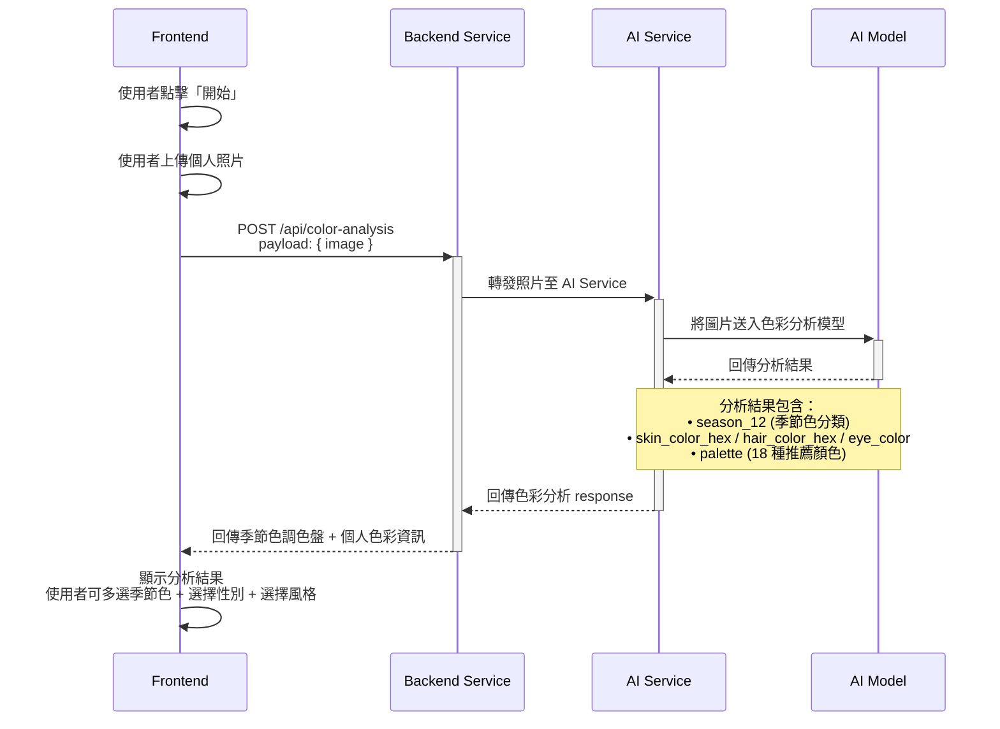
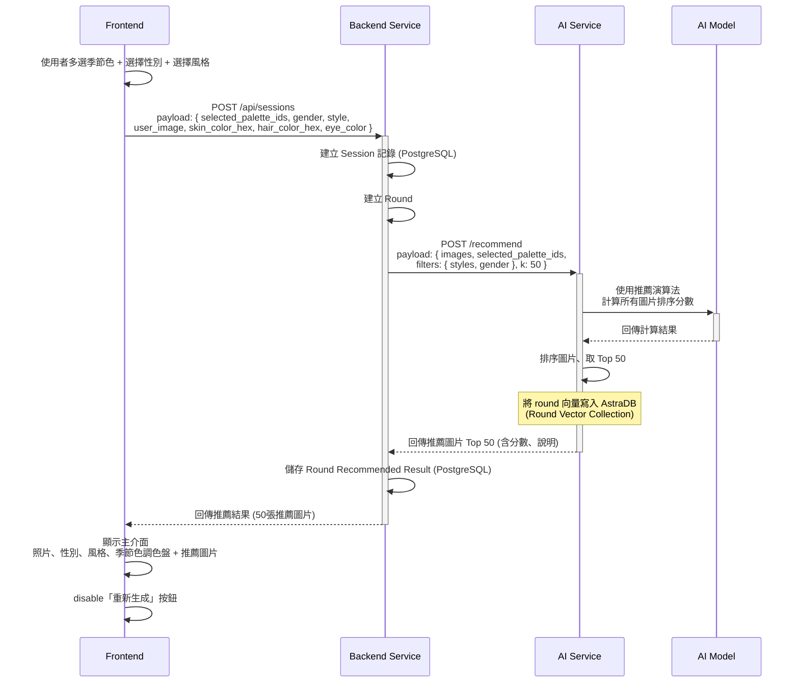
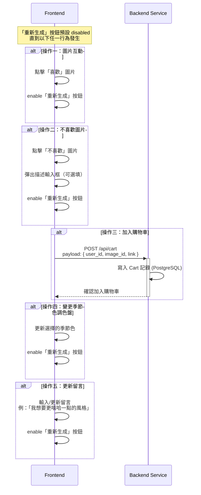
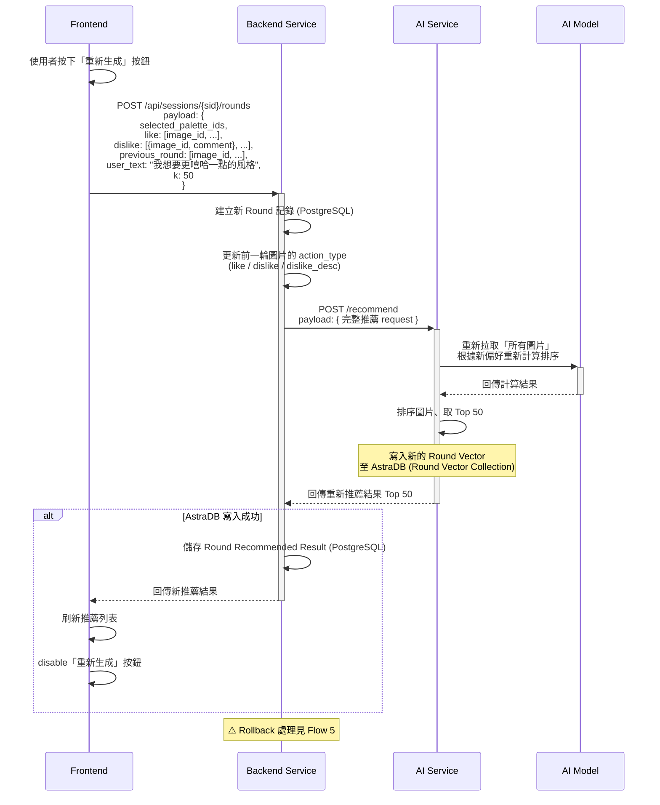
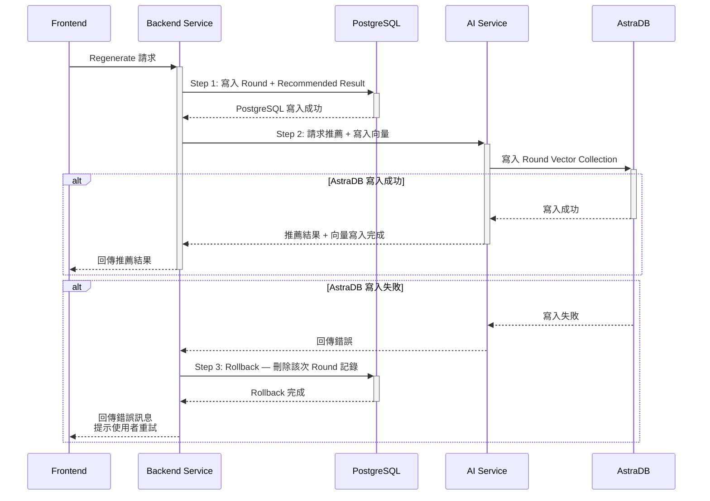
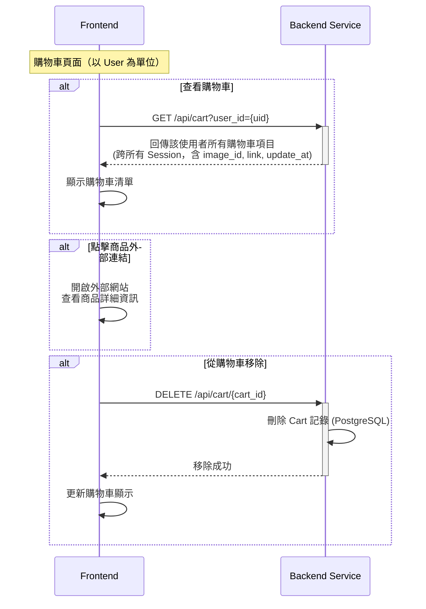
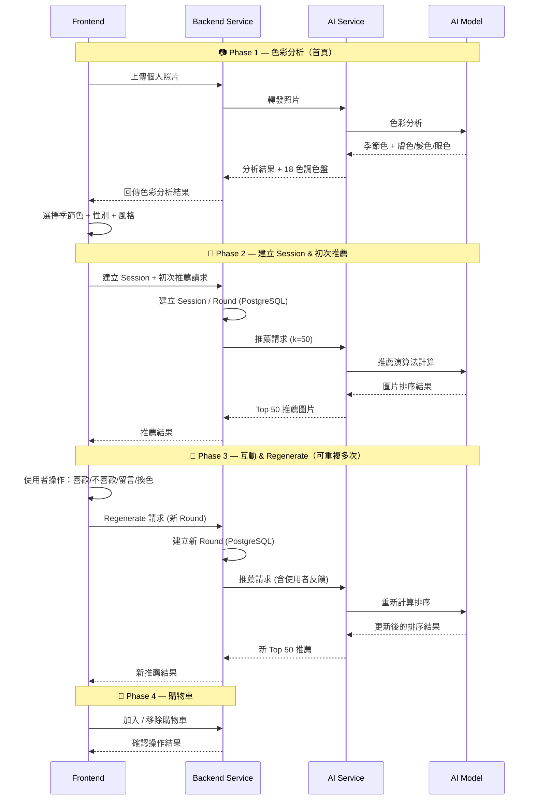

# AuraWear — System Architecture

## Overview

AuraWear 是一個基於 AI 的個人色彩分析與服飾推薦系統。使用者上傳個人照片後，系統透過 AI 模型分析出適合的季節色調色盤，再根據使用者偏好持續推薦服飾圖片。

### Tech Stack

| Layer               | Technology                                        |
| ------------------- | ------------------------------------------------- |
| **Frontend**        | TypeScript, Next.js, TailwindCSS, Shadcn          |
| **Backend Service** | Python, FastAPI, psycopg, PostgreSQL              |
| **AI Service**      | DS 團隊訓練的 AI Model, AstraDB (向量 + 圖片屬性) |

---

### 系統角色

| 角色                | 說明                                                                              |
| ------------------- | --------------------------------------------------------------------------------- |
| **Frontend**        | Next.js 前端應用，負責使用者互動與 UI 呈現                                        |
| **Backend Service** | FastAPI 後端服務，負責與前端溝通、管理 PostgreSQL 業務資料、轉發請求至 AI Service |
| **AI Service**      | 推薦演算法服務，負責接收使用者反饋、管理 AstraDB 向量資料、計算推薦結果           |
| **AI Model**        | DS 團隊訓練的深度學習模型，負責色彩分析與圖片 embedding                           |

---

## Flow 1 — 色彩分析（首頁：上傳照片）

使用者上傳個人照片，後端轉發至 AI Service，AI Model 分析出使用者的膚色、髮色、眼睛顏色，以及推薦的季節色調色盤（18 種顏色）。



### 色彩分析 Response 結構

```json
{
  "season_12": "Light Spring",
  "season_hex": "#DADADA",
  "season_confidence": 0.82,
  "undertone": "warm",
  "skin_color_hex": "#D4A574",
  "hair_color_hex": "#4A3728",
  "eye_color": "brown",
  "eye_color_hex": "#6B4226",
  "eye_color_confidence": 0.75,
  "palette": [
    {"id": "ls_01", "hex": "#FFB7A5", "name": "Peach Blossom", "season": "Light Spring"},
    ...
  ]
}
```

---

## Flow 2 — 建立 Session 與初次推薦（進入主介面）

使用者確認選定的季節色、性別與風格後，後端建立 Session + 第一個 Round，並向 AI Service 請求初次推薦。



---

## Flow 3 — 使用者互動操作（Round 內）

在一個 Round 內，使用者可以對推薦圖片進行操作、更新留言、變更調色盤顏色。這些操作會記錄在前端，直到使用者按下「重新生成」。



---

## Flow 4 — Regenerate 重新推薦

使用者按下「重新生成」按鈕後，前端彙整該 Round 的所有互動資料，送出至後端，觸發 AI Service 重新計算推薦排序。



---

## Flow 5 — Rollback 機制

為確保 PostgreSQL 與 AstraDB 之間的資料一致性，採用 **PostgreSQL 優先** 的寫入策略。



---

## Flow 6 — 購物車操作

購物車以使用者（User）為單位，跨所有 Session 收集使用者加入的圖片。



---

## 完整系統流程總覽



---

## API Endpoints 概覽

| Method   | Endpoint                     | 說明                                         |
| -------- | ---------------------------- | -------------------------------------------- |
| `POST`   | `/api/color-analysis`        | 上傳照片進行色彩分析                         |
| `POST`   | `/api/sessions`              | 建立 Session + 初次推薦                      |
| `POST`   | `/api/sessions/{sid}/rounds` | Regenerate — 建立新 Round                    |
| `GET`    | `/api/cart?user_id={uid}`    | 查看購物車（以 User 為單位，跨所有 Session） |
| `POST`   | `/api/cart`                  | 加入購物車                                   |
| `DELETE` | `/api/cart/{cart_id}`        | 從購物車移除                                 |

---

## 非功能性設計要點

- **資料一致性**：採用 PostgreSQL 優先寫入策略，AstraDB 失敗時 Rollback PostgreSQL 記錄
- **推薦機制**：每次推薦回傳 50 張圖片，依分數由高到低排序
- **Regenerate 觸發條件**：變更季節色 / 喜歡或不喜歡圖片 / 更新留言，三者至少符合一項才 enable
- **Round 機制**：每次 Regenerate 產生一個新 Round，完整記錄使用者偏好變化軌跡
- **購物車**：以 User 為單位，跨所有 Session 彙整使用者加入的圖片
